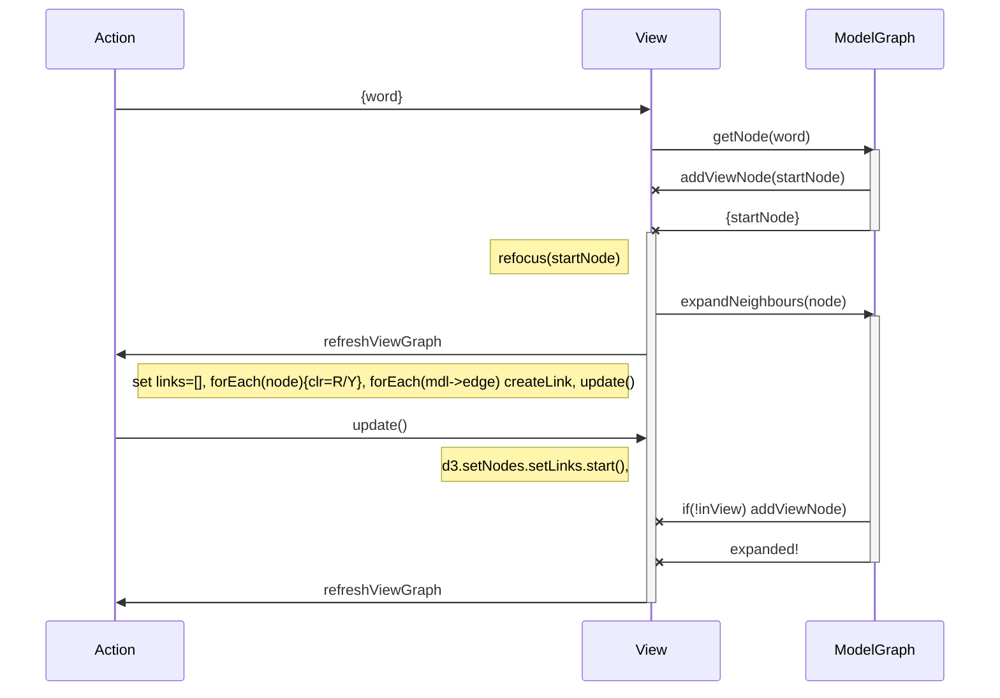

```mermaid
    sequenceDiagram
    Action->>View: {word}
    View->>ModelGraph: getNode(word)
    activate ModelGraph
    ModelGraph-xView: addViewNode(startNode)
    ModelGraph-xView: {startNode}
    deactivate ModelGraph
    activate View
    Note left of View: refocus(startNode)
    View->>ModelGraph: expandNeighbours(node)
    activate ModelGraph
    View->>Action: refreshViewGraph
    Note left of View: set links=[], forEach(node){clr=R/Y}, forEach(mdl->edge) createLink, update()
    Action->>View: update()
    Note left of View: d3.setNodes.setLinks.start(), 
    
    ModelGraph-xView: if(!inView) addViewNode)
    ModelGraph-xView: expanded!
    deactivate ModelGraph
    View->>Action: refreshViewGraph
    deactivate View
    
    
```